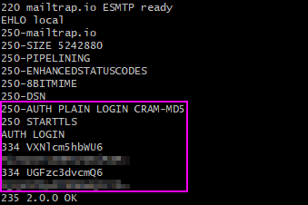

# GetPrankd

Authors : Monthoux Caroline, Poulard Rémi  
Lab repository : https://github.com/SoftEng-HEIGVD/Teaching-HEIGVD-RES-2019-Labo-SMTP

### Description

GetPrankd is a a simple TCP client application implemented in Java, able to use the Socket API to communicate with an SMTP server hosted on a Docker container. 

The client can automatically play pranks on a list of victims. It simply needs the following information :

- a list of e-mail addresses (victims).
- the number of groups of victims that should be formed. Minimum size for a group is 3 : 1 sender and 2 recipients.
- a list of e-mail messages (pranks).

Once fed with these data, the client automatically sends the pranks to all group recipients, from the address of the group sender.

### Requirements

The client is build using Java and to function, you need a **Java Runtime Environment** (there is no need to install a JRE if you already have a JDK installed). 

You will also need to install **Docker Toolbox** in order to launch the mock SMTP server in a container. Docker uses Virtual Box as a host for its virtual machine, so if you haven't it installed yet, don't forget to check "Install Virtual Box" during Docker Toolbox installation. Docker Toolbox can be found [here](https://docs.docker.com/toolbox/overview/).

### Setting up the mock SMTP server 

The SMTP server runs on a Docker container. To create the Docker image, do the following :

1. From the Docker Toolbox shell, open the `docker` folder from the project

2. Write the following command : `docker build -t heigvd/smtpserver .` 

   You can choose another name if needed.

   **Note :** MockMock default ports are 25 (for SMTP) and 8282 (for the web interface). 

### Running a prank campaign

Before the fun, a few work must be done. In the folder `conf`, you will have to provide 3 files that will allow you to run your campaign. Don't worry, they are already there for you to quickly run the campaign.

#### Configuration file

This file must contains these fields :

* `smtpServerIp=`, by default 192.168.99.100 (Docker)
* `smtpServerPort=`, by default 25
* `numberOfGroups=`

You are free to modify the `numberOfGroups` value. The client will automatically assign an equal number of victims in each group. If the SMTP server requires an authentication, these additional fields can be added :

* `username=`
* `password=`

**Username and password must be base64 encoded**.

#### Prank file

This file will contains the pranks. Once the campaign is started, the client will choose randomly between one of these pranks. **If you wish to add a new prank, beware the following rules** :

- Begin you prank with `Subject:`
- End your prank with the delimiter `---`

#### Victim file

This file contains each victim's mail address. **Don't forget that there must be at least 3 victims per group while filling this file**. 

Example : if you provide 8 addresses, the maximum group size is 2.

#### Ready ? Go !

You're all set !  To begin the campaign, run the mock server and start the client.

1. From the Docker shell, run a container with the following command : `docker run -p 25000:25 -p 8282:8282 heigvd/smtpserver`

2. From a shell, **go to the project location**, then launch the jar with the following command :

   `java -jar target/Lab_SMTP-1.0-SNAPSHOT-launcher.jar -c conf/mockmock_conf.properties -v conf/victims.utf8 -p conf/pranks.utf8`

   Parameters work as follow : `-c` to choose a configuration file, `-v` to choose a victims file and `-p` to choose a pranks file. You are free to create your own files and use them.

You can now have a look at the result by opening your Internet browser and navigate to [http://localhost:8282].

### Usage example

Here is what happen when you send a prank using MockMock SMTP Server : first, the client displays all the communication with the server on the terminal.

As we can see, one of the victims has been chosen as the sender, while the others are the recipients. We can now go to our web browser and open [http://localhost:8282]. Here, the mock SMTP Server displays all the messages sent.

If we click on the subject, we are redirected on the message information page, where we can see more detailed data.

#### Authentication

In case the SMTP server requires authentication, there is one more step in the communication between the client and the server. This step is visible on the console during the campaign.

As long as a username and a password are provided in the configuration file, this step is fully handled by the client.

### Implementation description

GetPrankd uses Java with an Object Oriented implementation. The code structure is the following :

#### GetPrankd

The main entrance of the program. Contains the main, in which arguments are read and used to create a Configuration object (see this class below). 

GetPrankd is responsible for gathering all the data and use it to produce a Mail. It first check if there is enough victims for the number of groups. Then, it constructs a Victim object for every mail address and a Prank object for every prank. GetPrankd then generates groups and populate them with the victims. It also choose a random prank among all given pranks. 

Once this is done, a Mail object is created for every group, containing the prank and a group. Mails are then given to an SMTPClient, which will handle the delivery. GetPrankd plays a major role in the program, since it make the use of every other classes.

#### Configuration

This class's job consists of accessing every configuration files and saving their data into lists. It makes server's information, number of groups, victims address and pranks available for GetPrankd to use.

#### Victim

Once GetPrankd obtained a list victims, it creates a Victim object for each one. A Victim consists of a mail address only, which can be accessed via getter.

#### Prank

Same thing as Victim. Once GetPrankd obtained a list pranks, it creates a Prank object for each one. A Prank consists of a string message only, which can be accessed via getter.

#### Group

A group is composed of a sender and several recipients, both Victim objects. Groups size is determined by dividing the total number of victims by the desired number of groups. If there are remaining victims, they are spread across the existing groups.

Example : there are 2 victims remaining if there is 3 groups for 17 victims (5 per group).

#### Mail

A Mail object represents the DATA part of a mail. Since the SMTP protocol asks for a `from`, a `to` and a `message` fields, Mail objects contain all of these. The `from` field will contain the sender of the mail and the `to` field will contains the recipient/s.

#### SMTPClient

The last step of the run. The SMTPClient is responsible for opening a TCP connection with the SMTP mock server and opening I/O streams. SMTP protocol follows some rules, so the execution must be strictly followed.

1. Server sends a ready message (220)
2. Client sends an EHLO
3. Server sends acknowledgments (code 250)
4. Client sends a MAIL FROM
5. Server send an acknowledgment (code 250)
6. Client sends a RCPT TO
7. Server send an acknowledgment (code 250)
8. Client sends a DATA
9. Server sends start/end instructions (code 354)
10. Client sends its message and ends with a dot (.)
11. Server send an acknowledgment (code 250)
12. Client sends a QUIT
13. Server closes the transmission

## References

- [MockMock server](https://github.com/tweakers/MockMock) on GitHub
- The [mailtrap](https://mailtrap.io/) online service for testing SMTP
- The [SMTP RFC](https://tools.ietf.org/html/rfc5321#appendix-D), and in particular the [example scenario](https://tools.ietf.org/html/rfc5321#appendix-D)
- Testing SMTP with TLS: `openssl s_client -connect smtp.mailtrap.io:2525 -starttls smtp -crl`

